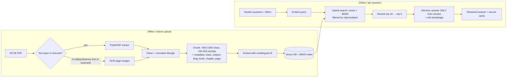

# NCTB Book Q&A — Project Guideline

> Goal: a student asks a question (Bangla or English) about any NCTB textbook, and the app answers **only from the book**, showing which book and page the answer came from.

---

## 0. TL;DR — Decisions

| Topic | Decision | Why |
|---|---|---|
| Approach | **RAG (Retrieval-Augmented Generation)**, not fine-tuning | Fine-tuning doesn't reliably store facts, can't cite pages, and has to be redone every time you add a book. RAG fixes all three. |
| App shape | **One app** (frontend + backend in one codebase, one deploy) | What you asked for |
| Recommended stack | **Python monolith: FastAPI + Jinja2 templates + HTMX + Pico.css/Tailwind (CDN)** | The whole ML pipeline (OCR, embeddings) is Python already. One language, one process, very little JS. |
| Alternative stack | Next.js (App Router) full-stack | Use this only if your team is stronger in JS/TS (see §4.2) |
| Vector DB | **ChromaDB or LanceDB (embedded, file-based)** to start → Postgres + pgvector if you need a hosted DB | No extra server to run |
| Embeddings | **`intfloat/multilingual-e5-large`** | The HF dataset was built with it; handles Bangla + English |
| LLM | **Gemma 4** via **Ollama Cloud** (`gemma4:31b`, default) or the Gemini API (`gemma-4-26b-a4b-it`) | Open Google model, handles Bangla; switch provider with `LLM_PROVIDER` |
| Starter data | `ShihabReza/nctb-qa` (load its chunks as your first corpus) | Saves you the OCR work for 16 books |

---

## 1. Why RAG instead of "fine-tuning"

You said "fine-tune application", but what you described (answer from the book, based on the book) is a **retrieval** problem:

| | Fine-tuning | RAG |
|---|---|---|
| Learns facts from books | Not reliably; still makes things up | Facts are retrieved word for word from the book |
| Shows source (book/page) | No | Yes (every chunk carries book + page) |
| Add a new book | Retrain (hours, GPU, money) | Upload PDF → index it (minutes) |
| Hackathon-friendly | No | Yes |

**Where fine-tuning *can* help later (optional):** fine-tune the **embedding model** or a **reranker** on the dataset's 12k question→chunk pairs to improve retrieval. Treat that as a stretch goal, not the core.

---

## 2. What the HF dataset actually gives you (and what it doesn't)

`ShihabReza/nctb-qa` (NCTBench, CC BY 4.0):

- **12,403 QA pairs** (12,203 train / 200 test), about half Bangla and half English
- Fields: `question`, `answer`, `evidence`, `source_text` (≈1000-char chunk), `chunk_id`, `source` (PDF name), `subject`, `language`, `class_num`, `grade_band`, `page_num`
- **6,887 unique chunks** from **16 books**, 1,374 pages
- Bangla text came from EasyOCR (expect some ligature/যুক্তাক্ষর errors); English came from direct PDF text extraction (clean)

### ⚠️ Important gap
**Coverage is only ICT + Science, Classes 6–9 (Bangla & English versions).**
"ALL NCTB books" means Classes 1–12, dozens of subjects, and both versions: **hundreds of books**. So:

1. **Use the dataset right away** → dedupe by `chunk_id` → you have a ready corpus for 16 books (an instant demo).
2. **Use the 200 test pairs as your evaluation set** (they're gold Q→A→page triples).
3. **You still need your own ingestion pipeline** (§5) for every other book. That's what your "upload" feature does.
4. **Attribution:** CC BY 4.0 means you must credit the dataset in the app/README.

---

## 3. System Architecture



Everything (pages, API routes, ingestion jobs) lives in **one FastAPI app**.

---

## 4. Stack

### 4.1 Recommended: Python monolith

| Layer | Choice | Notes |
|---|---|---|
| Web framework | **FastAPI** | Serves HTML pages *and* JSON/SSE endpoints |
| Templates | **Jinja2** | Server-rendered HTML; no separate frontend build |
| Interactivity | **HTMX** (+ `htmx-ext-sse` for streaming) | Chat without writing a React app |
| Styling | **Pico.css** (classless, minimal) or **Tailwind via CDN** | Minimal look with almost no CSS |
| Bangla font | **Hind Siliguri** or **Noto Sans Bengali** (Google Fonts) | Renders Bangla properly |
| PDF text | **PyMuPDF (`fitz`)** | Fast, gives page numbers |
| OCR | See §5.2 | Bangla is the hard part |
| Embeddings | **sentence-transformers** + `intfloat/multilingual-e5-large` (or `-base` on CPU) | Needs `"query: "` / `"passage: "` prefixes! |
| Keyword search | **rank_bm25** or SQLite FTS5 | Bangla benefits a lot from hybrid search |
| Reranker | `BAAI/bge-reranker-v2-m3` (multilingual) | Optional but noticeably better results |
| Vector DB | **ChromaDB** (persistent mode) or **LanceDB** | Stored as a folder; switch to pgvector later if needed |
| Metadata DB | **SQLite** (books, upload jobs, chat logs) | Same file, no server |
| LLM | **`ollama` Python client** → Ollama Cloud `gemma4:31b` (or `google-genai` → Gemini API) | Streaming; citations via numbered excerpts |
| Background jobs | FastAPI `BackgroundTasks` (hackathon) → RQ/Celery later | Ingesting a PDF can take minutes |
| Package manager | **uv** | Fast, reproducible |
| Deploy | **Hugging Face Spaces (Docker)**, Railway, or Render | One container |

### 4.2 Alternative: Next.js full-stack
Next.js App Router (route handlers + server components) + `@google/genai` + Supabase/Neon **pgvector** + Tailwind.
**Catch:** OCR and embedding are Python-first. You'd either run ingestion as separate Python scripts (so two languages) or use a hosted embedding API. Choose this only if the team is clearly JS-first.

---

## 5. Ingestion Pipeline (the hardest and most important part)

### 5.1 Getting the books
- Official source: **nctb.gov.bd** → textbook PDFs (Bangla & English versions, by class).
- Keep a manifest CSV: `file, class, subject, language, version(year), curriculum(new/old)`.
- NCTB is moving to a new curriculum, so the same class/subject can have **different editions**. Store the year/edition and let users pick.

### 5.2 Text extraction: decision per PDF

| PDF type | How to detect | What to do |
|---|---|---|
| English, digital | Extracted text reads cleanly | PyMuPDF directly |
| Bangla with **Unicode** text | Extracted text is readable Bangla | PyMuPDF directly |
| Bangla with **Bijoy/SutonnyMJ (ANSI) fonts** | Extracted text looks like `Avgvi†mvbvi` gibberish | Either convert Bijoy→Unicode (a converter library/script) **or** OCR it |
| Scanned / image-only | No text layer | OCR |

**Bangla OCR options (best → cheapest):**
1. **Google Cloud Vision / Document AI**: best Bangla accuracy; paid, but has a free tier
2. **Gemini / Gemma vision** (send the page image, ask for a Unicode transcription): good quality, same API key; fine for a few hundred pages
3. **Surya OCR**: open source, supports Bengali, good layout handling (GPU recommended)
4. **EasyOCR** (what the dataset used) / **Tesseract `ben`**: free, but more ligature errors

Run OCR **offline on Colab/Kaggle GPU**, not on the web server.

### 5.3 Cleaning
- Unicode normalize (NFC); fix common OCR confusions; remove headers/footers/page numbers
- Keep **page number** and, if you can detect it, **chapter/section title** for every chunk

### 5.4 Chunking
- 800–1000 characters, 150–200 overlap, split on sentence boundaries (`।`, `?`, `.`)
- Chunk metadata: `book_id, class, subject, language, chapter, page_start, page_end, text`
- Optional: prepend `"[Class 7 · ICT · Chapter 2]"` to the chunk text before embedding (helps retrieval)

### 5.5 Indexing
- Embed with `"passage: " + text`; store vector + metadata in Chroma/LanceDB
- Build the BM25 index on the same chunks
- For the HF dataset: `datasets.load_dataset("ShihabReza/nctb-qa")` → unique `chunk_id` → `source_text` + metadata → same index

---

## 6. Query / Answer Flow

1. **Input:** question + optional filters (Class, Subject, Language/Version). Filters help a lot with accuracy, because Class 6 and Class 9 Science overlap heavily.
2. **Retrieve:** vector top-20 (`"query: " + question`) + BM25 top-20 → merge (Reciprocal Rank Fusion)
3. **Rerank** → keep top 5 (≈4–5k tokens of context)
4. **Generate with Gemma:**
   - Number the excerpts `[1]…[n]` in the prompt and tell the model to cite them; parse the `[n]` markers from the answer to show the matching book/page
   - System prompt:
     - Answer **only** from the provided book excerpts
     - Answer in the **same language as the question**
     - If the excerpts don't contain the answer, say so (e.g. "বইয়ে এই প্রশ্নের উত্তর পাওয়া যায়নি") and don't guess
     - Keep it student-friendly; quote the textbook definition when one exists
   - **Stream** the response to the browser (SSE)
5. **Show sources:** a card per citation: *Book · Class · Page*, plus an expandable excerpt
6. **Safety net:** if the top rerank score is below a threshold, skip the LLM and reply "not found in the selected books"

---

## 7. Minimal UI

Three screens in total:

```
┌──────────────────────────────────────────────┐
│  NCTB প্রশ্নোত্তর                     [বাংলা|EN] │
├──────────────────────────────────────────────┤
│  [Class ▾] [Subject ▾] [Version ▾]            │
│                                              │
│  🧑 সালোকসংশ্লেষণ কী?                          │
│  🤖 সালোকসংশ্লেষণ হলো ... [1]                   │
│     ┌ Source ─────────────────────────┐       │
│     │ [1] Science · Class 7 · p. 42 ▸ │       │
│     └─────────────────────────────────┘       │
│                                              │
│  ┌────────────────────────────────┐ [Ask]    │
│  │ Type your question…            │          │
│  └────────────────────────────────┘          │
└──────────────────────────────────────────────┘
```

1. **`/`**: chat (as above)
2. **`/admin/upload`** (password-protected): upload PDF + fill in class/subject/language → shows ingestion progress
3. **`/admin/books`**: list of indexed books, chunk counts, re-index/delete

Design rules: one column, max-width ~720px, system/Hind Siliguri font, one accent color, dark mode via `prefers-color-scheme`, no sidebar.

---

## 8. Project Structure (Python monolith)

```
Hackathon_project/
├── app/
│   ├── main.py              # FastAPI app, routes for pages + /api/ask (SSE)
│   ├── config.py            # env vars (LLM_PROVIDER, OLLAMA_API_KEY, ADMIN_PASSWORD, paths)
│   ├── rag/
│   │   ├── retriever.py     # hybrid search + rerank
│   │   ├── generator.py     # Gemma call, prompt, citations → source cards
│   │   └── embeddings.py
│   ├── ingest/
│   │   ├── extract.py       # PyMuPDF + Bijoy detection
│   │   ├── ocr.py           # pluggable OCR backend
│   │   ├── chunk.py
│   │   ├── index.py
│   │   └── load_hf.py       # import ShihabReza/nctb-qa chunks
│   ├── templates/           # base.html, chat.html, admin/*.html, partials/*
│   └── static/              # tiny css, htmx
├── data/
│   ├── pdfs/                # raw books (git-ignored)
│   ├── vectordb/            # Chroma/Lance files (git-ignored)
│   └── app.db               # SQLite
├── eval/
│   └── run_eval.py          # uses HF test split (200)
├── scripts/                 # one-off: bulk OCR on Colab, bulk ingest
├── pyproject.toml
├── Dockerfile
└── .env.example
```

---

## 9. Evaluation (do this; judges love numbers)

Using the dataset's **200 test pairs**:

| Metric | How |
|---|---|
| **Retrieval Hit@5** | Is the gold `chunk_id` (or same page) among the top-5 retrieved? |
| **MRR** | Rank of the gold chunk |
| **Answer correctness** | LLM-as-judge: does the answer match the gold `answer`? |
| **Faithfulness** | LLM-as-judge: is every claim supported by the retrieved chunks? |
| **Refusal check** | 20 hand-made out-of-syllabus questions; the app should say "not found" |

Report them split by **Bangla vs English** and by **Class**. Bangla OCR quality will show up here.

---

## 10. Cost estimate (per question)

Each question sends ~5,000 input tokens (5 excerpts + prompt) and gets ~500 output tokens back.
Ollama Cloud and the Gemini API each have their own plans and rate limits. Check your quota on ollama.com (or Google AI Studio) before the demo, and keep the other provider configured as a backup (`LLM_PROVIDER` in `.env`).
Embedding, search, and reranking run locally and cost nothing per query.

---

## 11. Phased Plan

| Phase | Deliverable | Est. time |
|---|---|---|
| **1. Skeleton** | FastAPI + Jinja + HTMX chat page, `/api/ask` streams a dummy reply | 0.5 day |
| **2. Instant corpus** | Load HF dataset chunks → embed → Chroma; real retrieval + Gemma answers with page citations | 1 day |
| **3. Eval baseline** | `run_eval.py` on the 200 test pairs → Hit@5, correctness | 0.5 day |
| **4. Quality** | Hybrid BM25 + rerank + filters + "not found" threshold → re-run eval | 1 day |
| **5. Ingestion** | Admin upload → extract/OCR → chunk → index (background job + progress) | 1–2 days |
| **6. More books** | Bulk OCR on Colab for priority classes/subjects | ongoing |
| **7. Polish & deploy** | Dark mode, mobile, Dockerfile, HF Spaces deploy, README with metrics + dataset credit | 0.5 day |

---

## 12. Risks & Mitigations

| Risk | Mitigation |
|---|---|
| Bangla PDFs in Bijoy fonts produce garbage text | Detect it automatically; convert or OCR |
| OCR ligature errors hurt retrieval | Hybrid search (BM25 tolerates partial matches), a better OCR backend, keep page images for verification |
| Same topic in several classes gives wrong-class answers | Class/subject filters; show the class on every source card |
| LLM answers from its own knowledge | Strict system prompt + citations + low-score refusal + faithfulness eval |
| e5-large is slow on a free CPU | Use `multilingual-e5-base`, or precompute everything and only embed the query |
| Copyright/redistribution | Don't redistribute PDFs publicly; link to nctb.gov.bd; credit the dataset (CC BY 4.0) |
| Upload abuse | Admin password; size/type limits on upload |

---

## 13. ❓ Questions for you (please answer so we can lock the plan)

1. **Language:** Are you and your team comfortable with **Python** (recommended monolith), or do you prefer **JS/TypeScript (Next.js)**?
2. **Scope for the hackathon:** Demo with the **16 books from the dataset** first, or do you need specific other classes/subjects (which ones?) on demo day?
3. **"Upload all books":** Is upload an **admin-only** feature (you upload the books), or should **any user** upload their own PDF?
4. **Curriculum/edition:** New curriculum (2023+), old curriculum, or both?
5. **LLM quota:** Which Ollama Cloud plan are you on? Free-tier rate limits may be too low for a live demo with many users.
6. **OCR budget:** Is a paid OCR (Google Vision or Gemini vision) allowed for Bangla books, or free/open source only (Surya/EasyOCR/Tesseract)?
7. **Hosting:** Where should it run: Hugging Face Spaces, Render/Railway, a VPS, or only localhost for the demo? Is a GPU available anywhere?
8. **Users & history:** Do you need login, saved chat history, or multi-turn follow-ups ("explain more simply"), or are single questions enough?
9. **Answer style:** Short textbook-style answers, or also exam-oriented formats (MCQ explanations, সৃজনশীল প্রশ্ন structure)?
10. **Deadline:** When is the hackathon demo? That decides how far we get into Phases 5–6.
